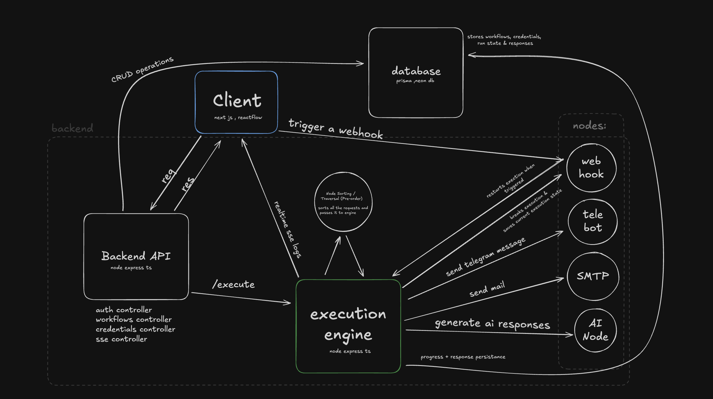

# Workfloww — Visual Workflow Automation with AI and Integrations

Workfloww is a lightweight automation tool for building workflows visually — triggers, actions, and AI agents, without writing backend code. Workflows can fire webhooks, send Telegram messages, send Gmail emails, or generate responses using AI.

The system supports stateful execution, response chaining between nodes, per-user credential management, and webhook-based resume.

**Live:** [workfloww.bitshitfalse.com](https://workfloww.bitshitfalse.com)
**Built by:** Sanjana Kumari — [GitHub](https://github.com/sforsanjnarao) · [X](https://x.com/bitshitfalse) · [LinkedIn](https://www.linkedin.com/in/sforsanjnarao/)

---

## Features

- Visual workflow builder using React Flow
- Trigger-based execution (webhooks)
- Telegram message action
- Gmail email action
- AI Agent response generation
- User-specific credential storage (AES-256-GCM encrypted at rest)
- Node-to-node response passing
- Real-time execution logs over SSE
- Persistent response storage (PostgreSQL)

---

## Architecture Overview



Workflows are saved as JSON (nodes + connections) and executed with a pre-order traversal of the graph. Execution can pause on a webhook node and resume later when that webhook is hit. Outputs are persisted in the `Responses` table so later nodes can chain off earlier ones. Logs stream to the browser over SSE.

---

## Tech Stack

| Area       | Technology                             |
| ---------- | -------------------------------------- |
| Frontend   | Next.js 15, TypeScript, React Flow     |
| Backend    | Node.js, Express, TypeScript           |
| Database   | PostgreSQL (Neon), Prisma              |
| Auth       | JWT, bcrypt                            |
| AI         | Gemini via LangChain / LangGraph       |
| Monorepo   | Turborepo                              |
| Deployment | Frontend on Vercel, API on Railway     |

---

## Node Types

| Node            | Description                                                 |
| --------------- | ----------------------------------------------------------- |
| Trigger         | Initiates a workflow (webhook based)                        |
| Webhook         | Pauses the run; resumes when the callback URL is hit        |
| Telegram Action | Sends a Telegram message using saved credentials            |
| Gmail Action    | Sends an email using stored SMTP credentials                |
| AI Agent        | Generates dynamic output which can be passed to other nodes |

---

## Setup

### 1. Clone

```bash
git clone https://github.com/sforsanjnarao/super30.git
cd super30/super30-assment/0n8n
```

### 2. Install

```bash
npm install
```

### 3. Start Postgres

Either use the bundled container (host port **5433**, so it won't clash with an existing local Postgres):

```bash
docker compose up -d
```

…or point `DATABASE_URL` at a hosted database such as Neon.

### 4. Environment variables

`packages/db/.env`

```
DATABASE_URL="postgresql://..."
```

`apps/api/.env` — the API starts with `node --env-file=.env`, so **every** runtime var must live here (`packages/db/.env` is not loaded by that process):

```
DATABASE_URL="postgresql://..."          # same value as above
JWT_SECRET="<openssl rand -hex 32>"      # signs auth tokens
CREDENTIALS_SECRET="<openssl rand -hex 32>"  # AES key for stored credentials — changing it orphans saved credentials
NEXT_PUBLIC_BACKEND_API="http://localhost:3002"  # this API's own public URL (used in await-Gmail resume links)
CORS_ORIGINS="http://localhost:3000"     # comma-separated allowed browser origins
GOOGLE_API_KEY=""                        # Gemini key; only the AI Agent node needs it
```

`apps/web/.env`

```
NEXT_PUBLIC_BACKEND_API="http://localhost:3002"
```

### 5. Apply migrations

```bash
npm run db:deploy
```

Use the `db:*` scripts rather than `npx prisma …` — a bare `npx` outside the workspace downloads Prisma 7, which rejects this v6 schema.

### 6. Run

```bash
npm run dev
```

Web on `http://localhost:3000`, API on `http://localhost:3002`. Health check: `curl localhost:3002/health`.

---

## Deployment

- **API → Railway.** Set `DATABASE_URL`, `JWT_SECRET`, `CREDENTIALS_SECRET`, `GOOGLE_API_KEY`, then generate a domain and set `NEXT_PUBLIC_BACKEND_API` to that domain and `CORS_ORIGINS` to the frontend's URL.
- **Web → Vercel.** Root directory `super30-assment/0n8n/apps/web`. Set `NEXT_PUBLIC_BACKEND_API` to the Railway URL **before** building — `NEXT_PUBLIC_*` vars are inlined at build time.

---

## Security Notes

- Credentials are stored per user, encrypted, and must not be logged.
- Never commit environment variables.
- All outbound execution must validate credentials before running.
- Webhooks should be validated to prevent unauthorized triggers.

---

## Roadmap

| Feature                           | Status   |
| --------------------------------- | -------- |
| Real-time Logs                    | Complete |
| Webhook Resume                    | Complete |
| AI Agent Node                     | Complete |
| Node Validation Schema            | Planned  |
| Retry per Node                    | Planned  |
| Queue-based Worker System         | Planned  |
| Multi-workflow Parallel Execution | Planned  |
